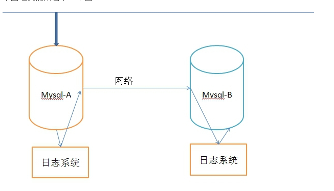
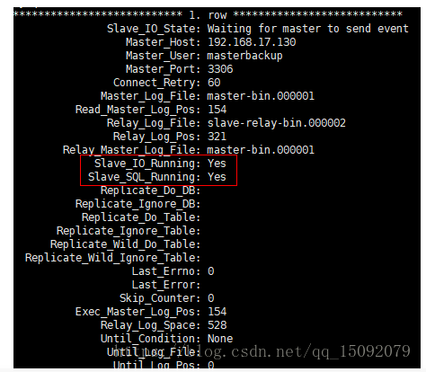

#### 一、mysql安装

##### 1.下载mysql

https://dev.mysql.com/get/Downloads/MySQL-5.7/mysql-5.7.23-linux-glibc2.12-x86_64.tar.gz

##### 2.解压文件

```
tar -xzvf mysql-5.7.23-linux-glibc2.12-x86_64.tar.gz
mv mysql-5.7.23-linux-glibc2.12-x86_64 /usr/local/mysql
```

##### 3.创建mysql用户组和用户并修改权限

```
groupadd mysql
useradd -r -g mysql mysql
```

##### 4.**创建数据目录并赋予权限**

```
mkdir -p  /data/mysql              #创建目录
chown mysql:mysql -R /data/mysql   #赋予权限
```

##### 5.**配置my.cnf**

```
vim /etc/my.cnf
```

**内容如下**

```
[mysqld]
bind-address=0.0.0.0
port=3306
user=mysql
basedir=/usr/local/mysql
datadir=/data/mysql
socket=/tmp/mysql.sock
log-error=/data/mysql/mysql.err
pid-file=/data/mysql/mysql.pid
#character config
character_set_server=utf8
symbolic-links=0
explicit_defaults_for_timestamp=true
```

##### 6.初始化数据库

```
cd /usr/local/mysql/bin/
./mysqld --defaults-file=/etc/my.cnf --basedir=/usr/local/mysql/ --datadir=/data/mysql/ --user=mysql --initialize
```

**查看密码**

```
cat /data/mysql/mysql.err
```

##### 7.启动mysql

```
# 复制启动脚本到开机启动项
cp /usr/local/mysql/support-files/mysql.server /etc/init.d/mysql
#启动 service mysql start
#查看进程 ps -ef|grep mysql
```

##### 8.登录修改密码

```
cd /usr/local/mysql/bin
./mysql -u root -p
#使用错误文件的密码登录
#修改密码
set password=password('123456');
grant all privileges on *.* to root@'%' identified by '密码';
flush privileges;
```

9.配置环境变量,使得可以在任意路径使用mysql -u root -p

```
vim /etc/profile
#在最后一行加入以下内容
export PATH=/usr/local/mysql/bin:$PATH
#使修改生效
source /etc/profile
```

#### 二、mysql主从复制

##### 1.背景

大型网站为了软解大量的并发访问，除了在网站实现分布式负载均衡，远远不够，到了数据业务层、数据访问层，如果还是传统的数据结构，或者只是单单靠一台服务器来处理如此多的数据库连接操作，数据库必然会崩溃，特别是数据丢失的话，后果更是不堪设想。这时候，我们会考虑如何减少数据库连接。

利用主从数据库来实现读写分离，从而分担主数据库的压力。在多个服务器上部署mysql,将其中一台认为主数据库，而其他为从数据库，实现主从同步。其中住数据库主要负责写的操作，而从数据库则只负责主动读的操作，这样可以很大程度上避免数据丢失的问题，同时可以减少数据库的连接，减轻主数据库的负载。



```
在上面的模型中，Mysql-A就是主服务器，即master，Mysql-B就是从服务器，即slave。

在Mysql-A的数据库事件（例如修改数据库的sql操作语句），都会存储到日志系统A中，在相应的端口（默认3306）通过网络发送给Mysql-B。Mysql-B收到后，写入本地日志系统B，然后一条条的将数据库事件在数据库Mysql-B中完成。

日志系统A，是MYSQL的日志类型中的二进制日志，也就是专门用来保存修改数据库表的所有动作，即bin log，注意MYSQL会在执行语句之后，释放锁之前，写入二进制日志，确保事务安全。

日志系统B，不是二进制日志，由于它是从MYSQL-A的二进制日志复制过来的，并不是自己的数据库变化产生的，有点接力的感觉，称为中继日志，即relay log。

通过上面的机制，可以保证Mysql-A和Mysql-B的数据库数据一致，但是时间上肯定有延迟，即Mysql-B的数据是滞后的。因此，会出现这样的问题，Mysql-A的数据库操作是可以并发的执行的，但是Mysql-B只能从relay log中一条一条的读取执行。若Mysql-A的写操作很频繁，Mysql-B很可能就跟不上了。
```

主从同步复制有以下几种方式：

（1）同步复制，master的变化，必须等待slave-1,slave-2,...,slave-n完成后才能返回。

（2）异步复制，master只需要完成自己的数据库操作即可，至于slaves是否收到二进制日志，是否完成操作，不用关心。MYSQL的默认设置。

（3）半同步复制，master只保证slaves中的一个操作成功，就返回，其他slave不管。这个功能，是由google为MYSQL引入的。

##### 2.master主服务器的配置

###### 2.1配置文件my.cnf的修改

```
#在[mysqld]中添加：
server-id=1
log_bin=master-bin
log_bin_index=master-bin.index
binlog_do_db=test

#备注
#server-id 服务器唯一标识。
#log_bin 启动MySQL二进制日志，即数据同步语句，从数据库会一条一条的执行这些语句。
#binlog_do_db 指定记录二进制日志的数据库，即需要复制的数据库名，如果复制多个数据库，重复设置这个选项即可。
#binlog_ignore_db 指定不记录二进制日志的数据库，即不需要复制的数据库名，如果有多个数据库，重复设置这个选项即可。
#其中需要注意的是，binlog_do_db和binlog_ignore_db为互斥选项，一般只需要一个即可。
```

###### 2.2 创建从服务器的用户和权限

```
#进入mysql数据库
[root@localhost mysql]# mysql -uroot -p
Enter password:
 
#创建从数据库的masterbackup用户和权限
mysql> grant replication slave on *.* to masterbackup@'%' identified by '123456';
#备注
#192.168.17.%通配符，表示0-255的IP都可访问主服务器，正式环境请配置指定从服务器IP
#若将 192.168.17.% 改为 %，则任何ip均可作为其从数据库来访问主服务器
 
#退出mysql
mysql> exit;
```

###### 2.3重启mysql服务

```
[root@localhost mysql]# service mysql restart
Shutting down MySQL.... SUCCESS! 
Starting MySQL. SUCCESS! 
```

###### 2.4 查看主服务器状态

```
#进入mysql数据库
[root@localhost mysql]# mysql -uroot -p
Enter password:
 
#查看主服务器状态
mysql> show master status;
+-------------------+----------+--------------+------------------+-------------------+
| File              | Position | Binlog_Do_DB | Binlog_Ignore_DB | Executed_Gtid_Set |
+-------------------+----------+--------------+------------------+-------------------+
| master-bin.000001 |      154 | test         |                  |                   |
+-------------------+----------+--------------+------------------+-------------------+
```

##### 3.slave从服务器的配置

###### 3.1配置文件my.cnf的修改

```
#在[mysqld]中添加：
server-id=2
relay-log=slave-relay-bin
relay-log-index=slave-relay-bin.index
#replicate-do-db=test
#备注：

#server-id 服务器唯一标识，如果有多个从服务器，每个服务器的server-id不能重复，跟IP一样是唯一标识，如果你没设置server-id或者设置为0，则从服务器不会连接到主服务器。

#relay-log 启动MySQL二进制日志，可以用来做数据备份和崩溃恢复，或主服务器挂掉了，将此从服务器作为其他从服务器的主服务器。

#replicate-do-db 指定同步的数据库，如果复制多个数据库，重复设置这个选项即可。若在master端不指定binlog-do-db，则在slave端可用replication-do-db来过滤。

#replicate-ignore-db 不需要同步的数据库，如果有多个数据库，重复设置这个选项即可。
#其中需要注意的是，replicate-do-db和replicate-ignore-db为互斥选项，一般只需要一个即可。
```

###### 3.2重启mysql服务

```
[root@localhost mysql]# service mysql restart
Shutting down MySQL.... SUCCESS! 
Starting MySQL. SUCCESS!
```

###### 3.3 连接master主服务器

```
#进入mysql数据库
1.登录到mysql -uroot -p
#连接master主服务器
change master to master_host='192.168.5.129',master_port=3306,master_user='masterbackup',master_password='123456',master_log_file='master-bin.000001',master_log_pos=154;

```

3.4启动slave数据同步

```
#启动slave数据同步
mysql> start slave;
#停止slave数据同步（若有需要）
mysql> stop slave;
```

3.5查看slave信息

```
mysql> show slave status\G;
```



Slave_IO_Running和Slave_SQL_Running都为yes，则表示同步成功。

##### 4测试

（1）在主服务器上登陆mysql，且进入test数据库，创建test表，且插入一条数据

提示：这里最好用数据库管理工具（如nacicat）来操作

```
#创建tb_test表
​create table tb_test(ID varchar(36) primary key comment '主键ID',MEMO varchar(500) not null comment '信息');
 
#插入一条数据
insert into tb_test(ID,MEMO) values('1','one test');

```

(2）在从服务器上登陆mysql，且进入test数据库

你会发现从数据库中，也出现了tb_test表，且表中还有one test数据存在，证明同步数据成功。

##### 5.解决错误

若在主从同步的过程中，出现其中一条语句同步失败报错了，则后面的语句也肯定不能同步成功了。例如，主库有一条数据，而从库并没有这一条数据，然而，在主库执行了删除这一条数据的操作，那么从库没有这么一条数据就肯定删除不了，从而报错了。在此时的从数据库的数据同步就失败了，因此后面的同步语句就无法继续执行。

这里提供的解决方法有两种：

（1）在从数据库中，使用SET全局sql_slave_skip_counter来跳过事件，跳过这一个错误，然后执行从下一个事件组开始。

```
#在从数据库上操作
mysql > stop slave;
mysql > set global sql_slave_skip_counter=1;
mysql > start slave;
```

（2）在从数据库中，重新连上主数据库。这种操作会直接跳过中间的那些同步语句，可能会导致一些数据未同步过去的问题，但这种操作也是最后的绝招。最好就是令从数据库与主数据库的数据结构和数据都一致了之后，再来恢复主从同步的操作。

```
#在从数据库上操作
mysql > stop slave;
mysql> change master to master_host='192.168.5.129',master_port=3306,master_user='masterbackup',master_password='123456',master_log_file='master-bin.000001',master_log_pos=2050;
mysql > start slave;
 
#备注
#master_log_file和master_log_pos可能会不同，需要在主数据库中
show master status
```

 show variables like "rpl_semi_sync_%_enabled";

rpl_semi_sync_master_enabled=1