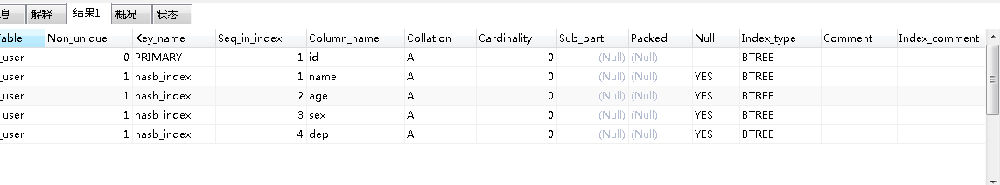
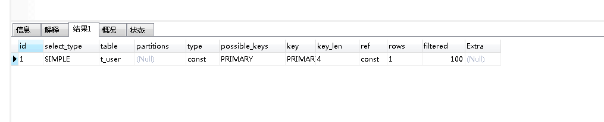
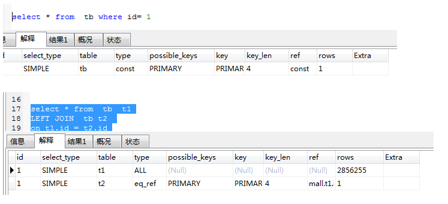
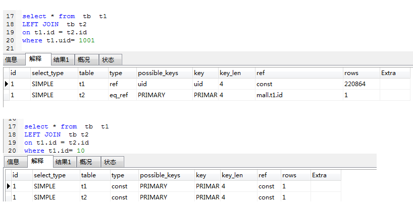
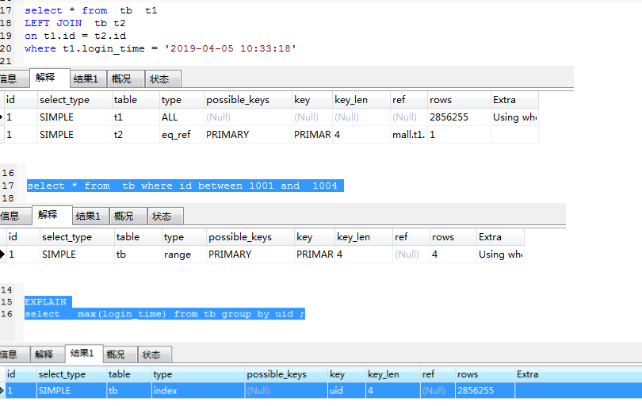

#### 一、前提

我们先看一下explain有哪些字段列，使用的版本是Mysql 8.0

##### 1.前期准备

```
-- 创建用户表
CREATE TABLE T_USER
(id int primary KEY,
 loginname varchar(20),
 name varchar(100),
 age int,
 sex char(1),
 dep int,
 address varchar(100)
) 
ENGINE = INNODB DEFAULT CHARSET=utf8 COMMENT='用户表';

-- 创建索引
create index nasb_index on t_user(name, age, sex, dep) ;
```

##### 2.查看有哪些索引：

show  index  from t_user;



##### 3.查看执行计划

explain select * from t_user where id =1 ;



1. id列：值越大越优先执行。
2. select_type列：查询的类型，不重要
3. table列：查询的哪个表
4. partitions列
5. type列：非常重要的值，要特别关注，一般要求做查询，最少在range级别。ALL：表示全表扫描，最低级别。
6. possible_keys列：可能存在的索引列
7. key列：实际用到的索引列
8. ken_len列：统计长度，int占4个字节，允许为空，多占一个字节
9. ref列
10. rows列：获取的条数，预估的值
11. filtered列：过滤了多少列，预估的值
12. Extra列：额外的。常见有using where、using index 索引覆盖、using index condition 索引下推。

##### 4.分析执行计划方式

一、执行计划最最需要看的就是type 和 Extra

其中type类型(访问类型):

system:表只有一行：system表。这是const连接类型的特殊情况。

const ：索引可以是主键或唯一索引，返回记录一定是一行记录的等值where条件。因为只有一行，这个值实际就是常数，因为MYSQL先读这个值然后把它当做常数来对待。（和下面的eq_ref的区别就是，const只有一条记录匹配（相当于是where id = 1的查询），eq_ref是要匹配多条记录（相当于是where id in(1,3,5,...)的查询））具体看下面的示例

eq_ref：在连接中，MYSQL在查询时，从前面的表中，对每一个记录的联合都从表中读取一个记录，它在查询使用了索引为主键或惟一键的全部时使用。（表连接字段是唯一索引/PK索引，关联后返回多条记录）

ref：这个连接类型只有在查询使用了不是惟一或主键的键或者是这些类型的部分（比如，利用最左边前缀）时发生。对于之前的表的每一个行联合，全部记录都将从表中读出。这个类型严重依赖于根据索引匹配的记录多少—越少越好。（和eq_ref的区别就是扫描的索引或连接索引不再是唯一索引了）

range：这个连接类型使用索引返回一个范围中的行，比如使用>或<，between and 查找时发生的情况。

index：这个连接类型是扫描所有的索引（和ALL的区别就是这个是扫描全部索引记录，ALL是扫描全部记录）。

ALL：这个连接类型对于前面的每一个记录联合进行完全扫描，这一般比较糟糕，应该尽量避免。

如下执行计划








以上type类型,从上到下,由好变坏。一般要求type最低要求是range级别。

key 
实际使用的索引。如果为NULL，则没有使用索引。很少的情况下，MYSQL会选择优化不足的索引。这种情况下，可以在SELECT语句中使用USE INDEX（indexname）来强制使用一个索引或者用IGNORE INDEX（indexname）来强制MYSQL忽略索引，有时候多索引时，可以使用强制索引（force index），指定索引。select id from  tb force index(PRI)  强制用主键索引

一般对于一个表有多个索引时，查看执行计划possible_keys 显示可能应用在这张表中的索引。最后实际只能选其中一个作为索引。这里我们有时候就需要使用强制索引，来选择查询最快的索引。

key_len 
使用的索引的长度。在不损失精确性的情况下，长度越短越好

ref 
显示索引的哪一列被使用了，如果可能的话，是一个常数

rows 
MYSQL认为必须检查的用来返回请求数据的行数。这个值越小越好

Extra 
关于MYSQL如何解析查询的额外信息。但这里可以看到的坏的例子是Using temporary和Using filesort，意思MYSQL根本不能使用索引，结果是检索会很慢

##### 5.extra解释

###### 1.using where

一般有两层意思：(1)表示通过索引访问时，需要再回表访问所需的数据；

(2)过滤条件发生在server层而不是存储引擎层；

针对第一种

如果执行计划中显示走了索引，但是rows值很高，extra显示为using where，那么执行效果就不会很好。因为索引访问的成本主要在回表上，这时可以采用覆盖索引来优化。（覆盖索引就是所需要查询的列只需要查索引就可以，不需要拿索引再去找表中其他列）通过覆盖索引也能将过滤条件下压，在存储引擎层执行过滤操作，这样效果是最好的。所以，覆盖索引是解决using where的最有效的手段。

###### 2.**using index condition（比较好）**

表示将过滤下压到存储层执行，防止server层过滤过多数据
如果extra中出现了using index condition，说明对访问表数据进行了优化。

###### **3、using temporary（应该避免）**

表示语句执行过程中使用到了临时表。以下子句的出现可能会使用到临时表：

order by，group by，distinct，union等数据不能直接返回给用户，就需要缓存，数据就以临时表缓存在用户工作空间。注意，可能会出现磁盘临时表，需要关注需要缓存的数据的rows。可以使用索引消除上面的四个操作对应的临时表。

###### **4、using index for group by（分组取最值的优化）**

表示通过联合索引完成group by,不用回表。

例如联合索引(a,b)，执行语句：select a from tb group by b;时就会出现using index for group by。

###### 5**、using index（比较好）**

表示实现了覆盖索引扫描；也就是需要访问的数据都在索引中，不需要回表。在一般情况下，减少不必要的数据访问能够提升效率。

###### **6、using filesort（应该避免）**

说明有排序行为，但是不一定是磁盘排序。